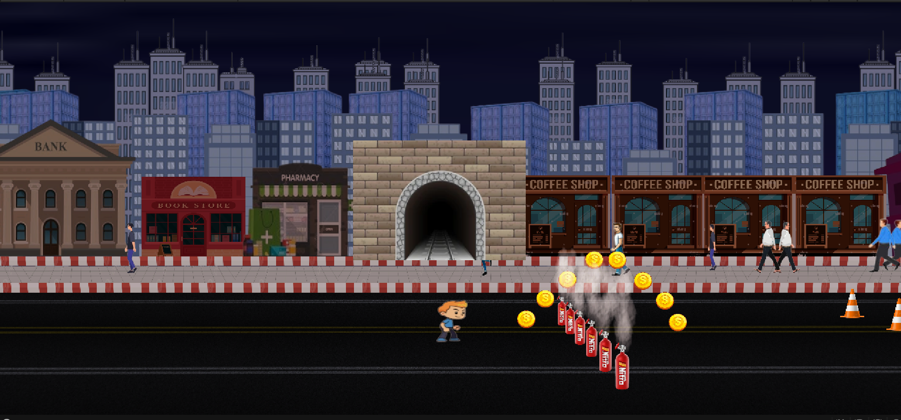

# 🏃‍♂️ 2D Endless Runner Game – Unity (C#)

This is a simple 2D side-scrolling endless runner game built in Unity.  
The player collects coins while avoiding obstacles like fire, cars, trucks, tyres, and manholes. If the player hits a deadly obstacle, the game ends and a Game Over screen appears.

---

## 🎮 Gameplay Features

- Horizontal player movement using Left/Right arrow keys
- Jumping with the Space bar
- Coin collection system
- Deadly obstacles: fire, cars, trucks, tyres, manholes
- Game Over screen with Restart and Quit buttons

---

## 🕹️ Controls

- ⬅️ Move Left: Left Arrow  
- ➡️ Move Right: Right Arrow  
- ⬆️ Jump: Spacebar

---

## 📦 Download and Play

You can download and play the `.exe` build here:  
👉 [Download from Google Drive](https://drive.google.com/file/d/1ZkVw0-j2ET6orux4Nofboi5TbkWXr2Fd/view?usp=sharing)

> Just extract the zip and run `2D_Endless_Runner.exe`. No installation needed.

---

## 🎥 Gameplay Demo

▶️ [Watch Gameplay Demo on Google Drive](https://drive.google.com/file/d/1lPTUsHgIVZv-5ucTUeVBo1bkm3YXvdxB/view?usp=sharing)

---

## 🖼️ Screenshots

  
  
  
  
  
  

---

## 🧰 Built With

- Unity (2D Mode)
- C# Scripting
- Rigidbody + Trigger Collisions
- GameManager + Obstacle Spawner

---

## 🧠 Developer

**M. Huzaifa Asad Hashmi**  
GitHub: [HuzaifaAsad](https://github.com/HuzaifaAsad)
